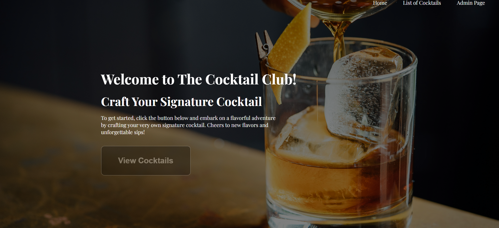
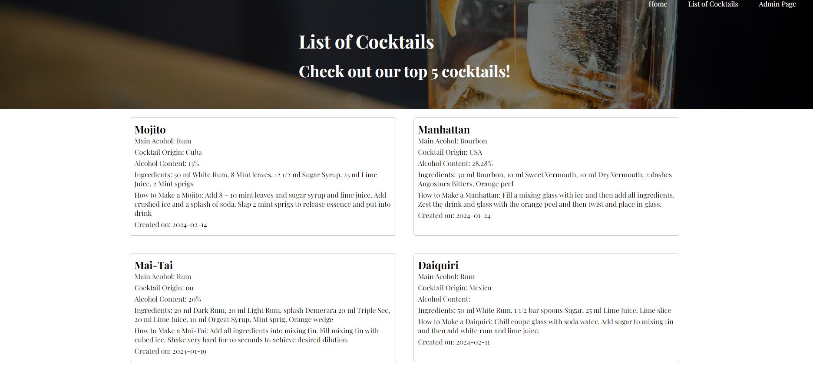
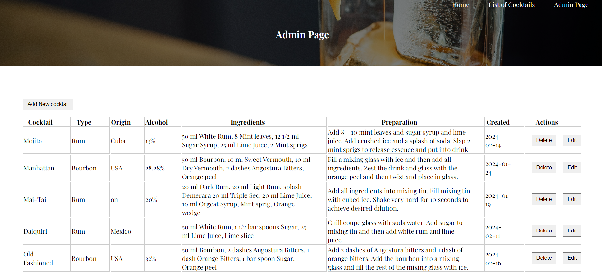
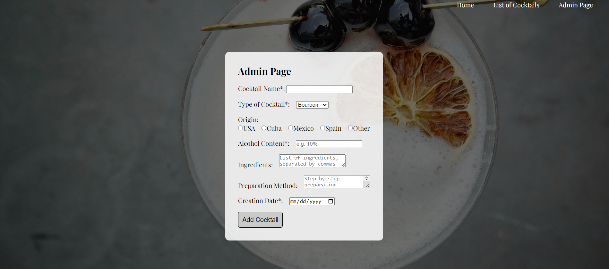

# CRUD Cocktail App with Admin Page
This is a Node.js website, using Express and Pug, for a cocktail app. MongoDB is used as the data source for the cocktail collection. There is an admin page that allows you to add, update and delete the cocktail drinks. Changing the information about the cocktails will reflect in the changes in the collection database on MongoDB.

## Tech Stack
* MongoDB
* Node.js
* Express
* Pug template engine

## Homepage

The homepage of the cocktail app displays basic information and provides navigation links to access different sections of the app.

## List of Cocktails

The "List of Cocktails" page displays a list of cocktails retrieved from the MongoDB database. Users can view details of each cocktail and navigate to other sections of the app.

## Admin Page | Update and Delete

The admin page allows authenticated users (the admin) to update and delete existing cocktail entries. This section provides functionalities to manage the cocktail collection effectively.

## Admin Page | Add

In the "Add" section of the admin page, authenticated users can add new cocktail entries to the collection. This feature enables users to contribute new recipes to the app.

## Setup Instructions

1. Clone the repository to your local machine.
2. Install dependencies using `npm install`.
3. Ensure MongoDB is installed and running.
4. Run the server using `npm start`.
5. Access the application in your web browser at http://localhost:8888.

## Usage

1. Navigate to the homepage to view basic information about the app.
2. Explore the "List of Cocktails" page to view existing cocktail entries.
3. Access the admin page to manage cocktail entries by adding, updating, or deleting them.

## Acknowledgements

Special thanks to MongoDB, Node.js, Express, and Pug for their amazing tools and frameworks that made this project possible.
Images used in the readme are for illustration purposes only and are sourced from Unsplash.
